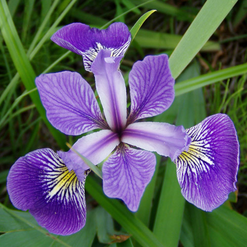
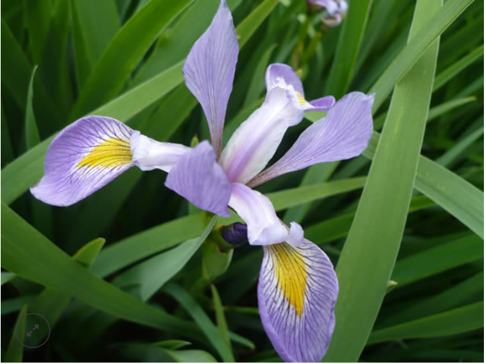

# This README accompanies my end of module project for Programming and Scripting
## Aaron Donnelly- G00299531
An Iris data set was obtained from the following link: http://www.randomservices.org/random/data/Fisher.html

# Table of contents
* 1- Origins of the Iris data set
* 2- A brief background on Python.
* 3- NumPy, Pandas , Matplotlib and Seaborn.
* 4- Histogram and scatter plot observations
    * 4.1- Observations from the ‘Measurement of petal length among species’
    * 4.2- Observations from the ‘Measurement of petal width among species’
    * 4.3- Observations from the ‘Measurement of sepal length among species’
    * 4.4- bservations from the ‘Measurement of sepal width among species’
    * 4.5- Scatter plot observations
* 5- Conclusion from the analysis of the histograms of all 4 measurements among the 3 species.
* 6- References

# 1- Origins of the Iris data set
The iris data set also know as the Fischer data set was compiled by Ronald Fischer in the 1930's. This data set is a complilation of diffrent sepal and petal lengths and widths of various types of iris flowers. This dataset is widely used by the computer science community as an introduction to data analysis and/or machine learning. The data was first published in the scientific journal 'Annals of human genetics'in the year 1936. Fischer titiled his paper 'The use of multiple measurements in taxonomic problems'. Fischer took 50 samples of three particular particular spieces of flower, Iris setosa, I. versicolor and Iris virginica. Images of these flowers can be seen below. Both Iris setosa and I. versicolor were found to be living in the same colony and the data obatined for these two particular species were provided to Fischer by Dr E.Anderson.[1]

# 2- A brief background on Python.
The programming language Python [2] can be used to analyse datasets of this type very efficiently. Python is a high level programming language developed by Guido Van Rossum from the Netherlands. Van Rossum soth to develope a language that was placed in between the computer langauges C and shell scripts. He wanted a language that 'felt more like a genuine programming langauge like C but was interpreted easier to use like a shell script without the terrible properties in terms of readability like shell scripts'[3]. After over a year of work van Rossum released his new language as open source. This allowed developers to work on the language and further develope it. Guido van Rossum however held the title of BDFL. This meant that van Rossum had the final say in what was contributed to the language by the developers. BDFL means 'Benevolent dictator for life' [4] and is a term that originated from the Python creator. Van Rossum has since resigned this role. Python is an interpreted language. This means that it is not coverted to machinie code until the actual python program is run. Python has a vast amount of applications. Some of these are web development, computer games, web apps and many more.

# 3- NumPy, Pandas , Matplotlib and Seaborn.
NumPy also known as numerical python is a fundamental package for analysing scientifc data using python and is the foundation on which many other python libraries have been built. Numpy was built by an american data scientist called Travis Oliphant however is open source, with many contributers. The main benefit of NumPy is how it deals with lists. A normal python list is tedious when carrying out calculations across a standard python list. NumPy makes this process much more efficient by its ablility to carry out the calulation across entire lists known as numpy arrays[5]. The NumPy based libraries used in this project are Pandas, Matplotlib and Seaborn. Pandas is a library used to create dataframes that can be manipulated and visualised for data analyses. This set of tools is also essential in machine learning. Matplotlib is another NumPy based libary that allows the user to plot data for better data visual analysis. Seaborn is a library that is built on top of Matplotlib and provides a better graphical representation of data for data analysis. 

# 4- Histogram and scatter plot observations

## 4.1- Observations from the ‘Measurement of petal length among species’
It can be seen from the histogram titled ‘Measurement of petal length among species’ that the species of Iris that had the greatest petal length was the virginica species. The setosa showed to have the minimum petal length with the versicolor falling between the two. From the histogram it can be seen that the difference in petal length is well distributed between the three species. This means that petal length is a characteristic that could be used to differentiate between species. There is only very slight overlap seen between the species virginica and versicolor with a small number of samples.

## 4.2- Observations from the ‘Measurement of petal width among species’
It can be seen from the histogram titled ‘Measurement of petal width among species’ that the data between species is very well distributed. Similar to the petal length measurement the Viriginca species of iris appears to have the wider petals with the setosa species again having the smaller petal width. Similar to the petal length measurement there is slight overlap in a small number of samples between the Virginica and Versicolor. This characteristic would also be considered a good source of differentiation between iris species. 

## 4.3- Observations from the ‘Measurement of sepal length among species’
It can be seen from the histogram titled ‘Measurement of sepal length among species’ that there is a large amount of overlap between species. Due to this fact sepal length would not be considered a reliable characteristic to differentiate between different iris species. Similar to the previous characteristics the virginica appeared to have the longer sepals with the setosa, again having the shorter sepals. The versicolor is again found between the virginica and setosa as being the average between the two however there is overlap between all three species for this characteristic.

## 4.4- Observations from the ‘Measurement of sepal width among species’
It can be seen from the histogram ‘Measurement of sepal width among species’ that the setosa species of iris has generally a larger sepal width. This characteristic would be useful when Identifying the setosa species of iris flower however there is a large degree of overlap between the species virginica and versicolor and thus we can conclude that this feature would not be an ideal factor in determining the species.

## 4.5- Scatter plot observations
Scatter plots of each pair of variables were generated using the .pairplot function of the seaborn library. An image of these plots can be seen below. This function allows you to generate a series of scatter plots for each pair of variables in the iris dataset.  These scatter plots clearly demonstrate a high degree of difference between the setosa species and the two other iris species. It also effectively demonstrates the fact that the versicolor species and viriginica species are quite similar in all characteristics with the viriginica samples generally being distributed further to the right and higher on the plots demonstrating a much larger flower. The clearest distinction that can be made between the virginica and the versicolor is in the sepal_length vs the petal_width plot. A plot displaying ‘univariate distribution’ can be seen running through the set of plots. These plots are useful for as they show the degree of variation between the different species based on the characteristics in the column.

# 5- Conclusion from the analysis of the histograms of all 4 measurements among the 3 species.
To conclude, the species that shows the greatest variation between the other two species is the setosa and because of this it would more than likely be the easiest of the three species to identify mainly because of its wider petals in comparison to the other 3 features. From analysing the plots it can be concluded that the best characteristics to identifity an iris species is the petal length and petal width. These characteristics show the least amount of overlap in all plots and thus these characteristics appear to be unique to the vast majority of samples of a particular species. As can be seen in the scatter plots the loci of each sample of each species is situated together with enough space between species to diffrentiate and make a guess as to which species the sample belongs.

# 6- References

* [1- Fisher, R., 1936. The use of multiple measurements in taxonomic problems.. The Annals of Eugenics, 7, 179-188.]
* [2- Python Software Foundation. Welcome to python.org. https://www.python.org]
* [3- Oracle Developers. (2020). The Story of Python, by Its Creator, Guido van Rossum. [Online Video]. 25 February 2019. Available   from: https://www.youtube.com/watch?v=J0Aq44Pze-w. [Accessed: 26 April 2020].]
* [4- Python.org. 2014. BDFL. [ONLINE] Available at: https://wiki.python.org/moin/BDFL. [Accessed 26 April 2020]. ]
* [5- i am biomed. (2014). What is Numpy?. [Online Video]. 16 April 2016. Available from: https://www.youtube.com/watch?v=pP5dQG0foTs.  [Accessed: 27 April 2020].]

Iris Setosa image taken from: http://www.perennials.com/plants/iris-setosa-var-arctica.html

Iris Versicolor image taken from: https://www.plant-world-seeds.com/store/view_seed_item/3664

Iris Virginica image taken from: https://bakerenvironmentalnursery.com/product/iris-virginica-southern-blue-flag-iris/